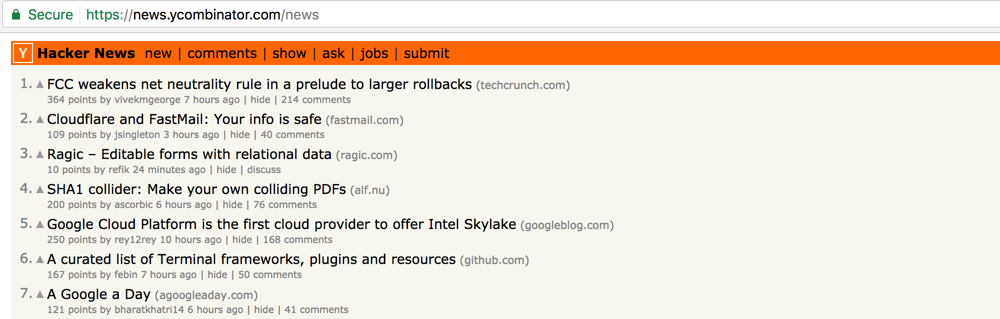
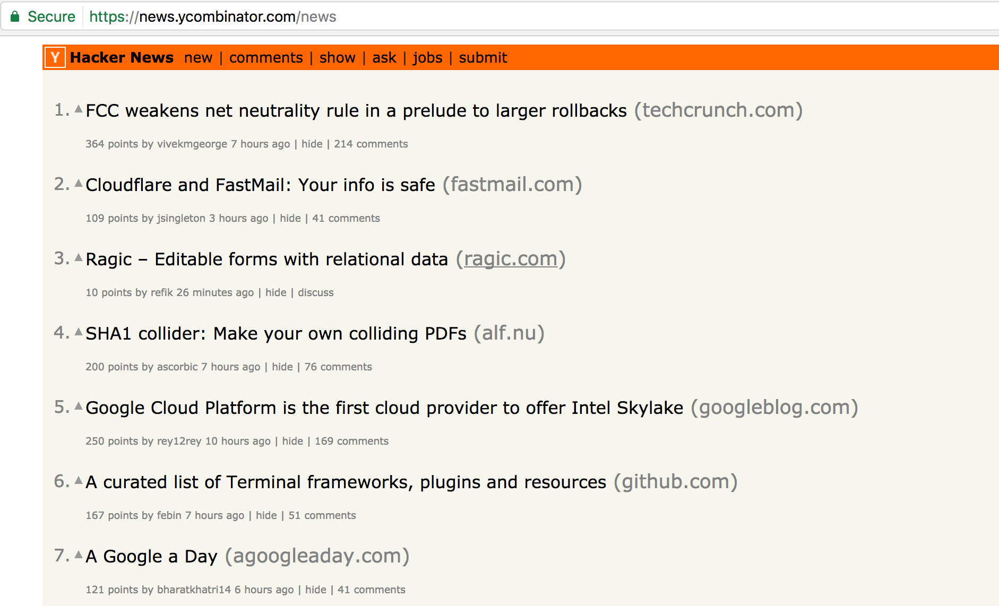
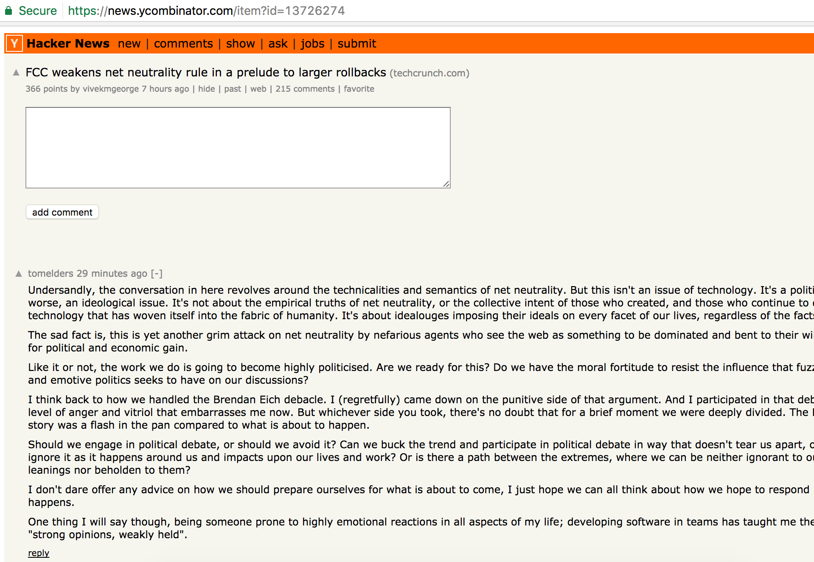
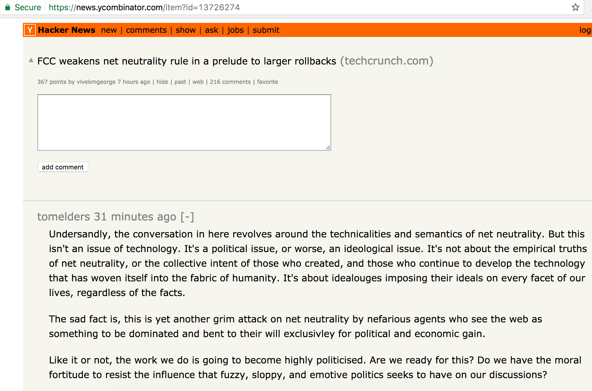

# HNView

A browser extension for chrome/firefox making hacker news style not that terrible.

## Why?

I read a lot on hacker news, and let's commit it, the style is terrible for reading.

## Screenshots

### Home page

Before:

After:

### News comment

Before:

After:

